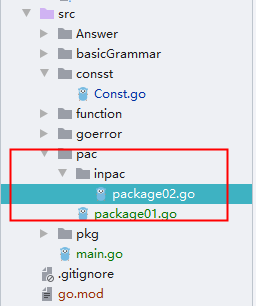

# GO 包
> 作者: [HuiFer](https://github.com/huifer)
>
> 仓库地址: https://github.com/huifer/learn-go

## main 包
- go 语言入口 `main` 函数所在的包称作`main`包,其中想使用别的代码需要进行包导入

## 包的定义
- go 语言中包的定义方式如:`package 包名` , 关键字`package`
注意点
1. 一个目录下的同级文件归属一个包
2. 包名可以和文件名不同(建议相同)
3. `main`包不可在其他地方使用,有且仅有一个

## 导入包
- go 语言中包的导入使用方式:`import 包名` 或者 `import (包名1,包名2...)`


## 包的别名
- go 语言支持包别名定义
```go
import (
p1 "包名1"
p2 "包名2"
)

```

## 使用
**注意: 公开的可以被别人使用的函数首字母大写**
- 创建方
```go
package pac

import "fmt"

func Pac01(){
	fmt.Println("第一个包")
}
```
- 使用方
```go
package main

import (
	pac "learn-go/src/pac"
)

func main() {
	pac.Pac01()

}


```
- 多层级

  
  
```go
package main

import (
	pac "learn-go/src/pac"
	"learn-go/src/pac/inpac"
	_ "learn-go/src/pac/inpac"
)


func main() {
	pac.Pac01()
	inpac.Package02()
}

```

## init 函数
- go 语言的init用于
    1. 注册
    2. 一次性的计算
    3. 初始化

- 执行顺序
    1. init优先级最高
    

本文代码
- [代码1](/src/pac)
- [代码2](/src/PackageMain.go)


## 练习
1. 定义包`utils`,创建函数输出时间,使用包中的这个函数
- [答案](/src/Answer/PackageAnswer.go)