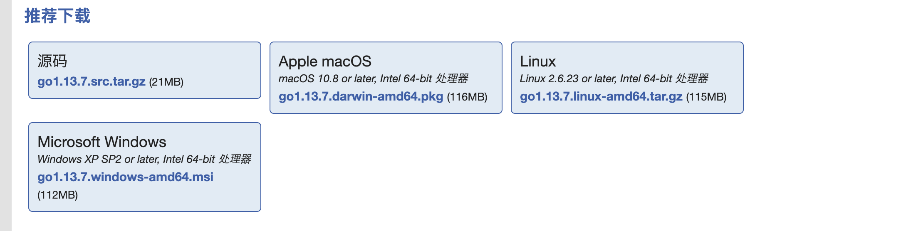
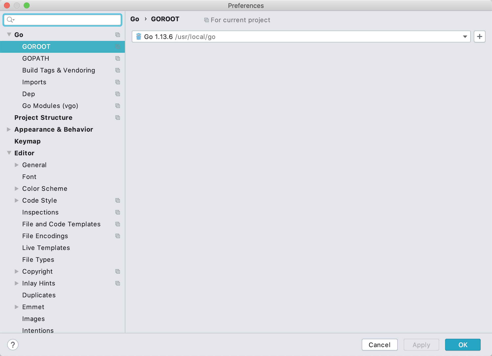
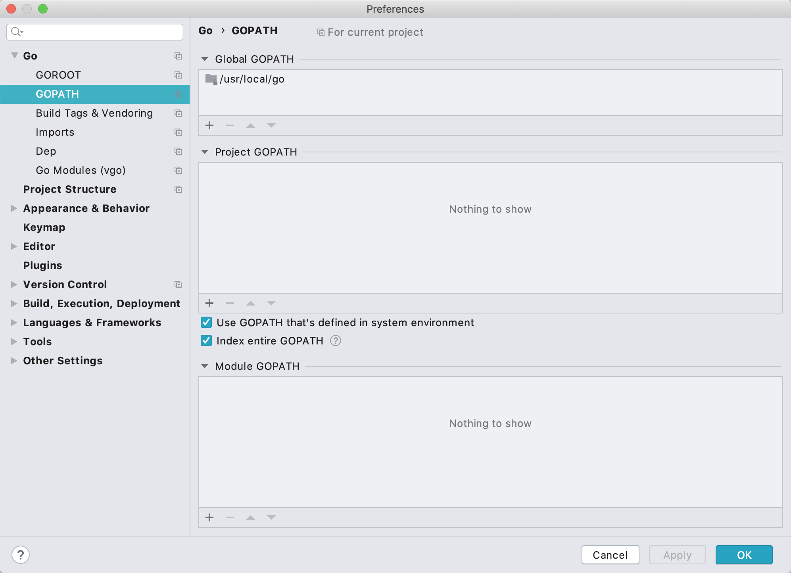
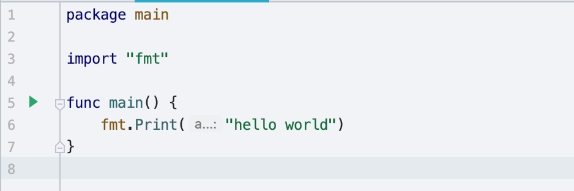
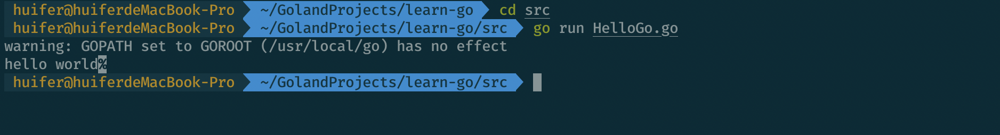

# 认识GO语言

> 作者: [HuiFer](https://github.com/huifer)
>
> 仓库地址: https://github.com/huifer/learn-go

## GO语言简介
> Go语言是2007年末由Robert Griesemer,Rob Pike,Ken Thompson主持开发，之后有Ian Lance Taylor,Russ Cox等人的加入，最终于2009年11月开源发布。它是一款简单的开源编程语言，它能让构造简单、可靠且高效的软件变得容易。


## GO语言的特点
- 并发与协程
- 基于消息传递的通信方式
- 丰富实用的内置数据类型
- 函数多返回值
- defer机制
- 反射(reflect)
- 高性能HTTP Server

## GO语言知名项目

- Docker: Docker 是一种操作系统层面的虚拟化技术，可以在操作系统和应用程序之间进行隔离，也可以称之为容器。Docker 可以在一台物理服务器上快速运行一个或多个实例。例如，启动一个 CentOS 操作系统，并在其内部命令行执行指令后结束，整个过程就像自己在操作系统一样高效。
  - 项目地址: https://github.com/docker/docker
- Kubernetes: Google 公司开发的构建于 Docker 之上的容器调度服务，用户可以通过 Kubernetes 集群进行云端容器集群管理。系统会自动选取合适的工作节点来执行具体的容器集群调度处理工作。其核心概念是 Container Pod（容器仓）。
  - 项目地址: https://github.com/kubernetes/kubernetes
- beego: beego 是一个类似 Python 的 Tornado 框架，采用了 RESTFul 的设计思路，使用Go语言编写的一个极轻量级、高可伸缩性和高性能的 Web 应用框架
  - 项目地址: https://github.com/astaxie/beego

## GO环境搭建
- 这里使用国内[studygolang](https://studygolang.com/)作为下载地址,go语言官网:[go](https://golang.org/)
- 下载下图中对应的版本即可.



- 此处不对源码安装进行说明,安装后配置环境变量`GOROOT`

  ```shell
  export GOROOT=/usr/local/go
  export PATH=$PATH:GOROOT
  ```
- GOROOT 为go 安装目录.
- GOPATH 为go的工作目录.
  

## 开发工具
- [GoLand](https://www.jetbrains.com/go/)

  - *GoLand* is an IDE by JetBrains aimed at providing an ergonomic environment for Go development.

- 优先配置`GO-GOROOT`中的地址

  

- 配置GOPATH

  
## hello world

- 按照惯例我们应该先来一句`hello world`， 代码: [HelloGo.go](/src/HelloGo.go)

```go
package main

import "fmt"

func main() {
	fmt.Print("hello world")
}

```


### 运行



- 在编辑器中可以直接点击绿色三角箭头运行

- 命令行模式下运行: `go run xxx.go` 执行上述语句就是运行

  

  

  
## 系统类型
- 静态语言,支持运行时动态类型
- 强类型
- 支持隐式类型推到
- 类型安全
- 之策 type 自定义数据类型

## 抽象
- 支持函数
- 类型组合支持面向对象
- 接口 duck 模型
- 多态通过接口支持

## 元编程
- 没有泛型支持
- 有反射支持


## 练习

1. 开发环境搭建
2. 控制台输出:`hello go`


